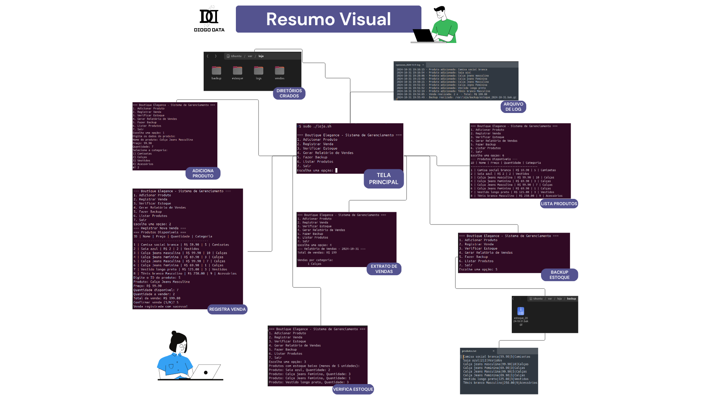

Scripts em shell são ferramentas poderosas que permitem automatizar diversas tarefas em sistemas Unix e Linux. Ao encapsular uma série de comandos em um único script, é possível otimizar processos, reduzir erros e aumentar a eficiência operacional. Essa linguagem de programação versátil facilita a manipulação de arquivos, a automação de tarefas administrativas e oferece um controle preciso sobre o sistema, tornando-a ideal para diversas aplicações.

Utilizando o conhecimento adquirido no curso [Hands-on Introduction to Linux Commands and Shell Scripting](https://www.coursera.org/account/accomplishments/verify/30JGE2RZY8T4 "Visite o certificado do curso") , apliquei em um cenário real o projeto Boutique Manager, que consiste em um sistema de gerenciamento em shell script para pequenas lojas de roupas. 

O sistema proporciona um conjunto integrado de funcionalidades essenciais para a administração de uma loja de roupas, iniciando pelo cadastro de produtos, que permite registrar informações detalhadas por categoria e gerenciar o estoque automaticamente. O módulo de vendas processa transações em tempo real, atualizando o estoque e registrando informações como data, hora e valores. Além disso, um sistema de monitoramento de estoque alerta proativamente sobre níveis baixos de produtos, facilitando a reposição. Relatórios de vendas oferecem análises abrangentes do desempenho do negócio, incluindo totais por categoria e período.

A segurança e a integridade dos dados são asseguradas por um sistema automatizado de backup, que protege informações críticas diariamente, além de um robusto sistema de logs que registra todas as operações para fins de auditoria. O sistema realiza validações em operações críticas, como a verificação da quantidade disponível em estoque antes das vendas, e usa arquivos temporários para manter a integridade durante atualizações. Todas essas funcionalidades são acessíveis por meio de um menu intuitivo, que organiza as operações de forma lógica, permitindo que usuários com diferentes níveis de experiência operem o sistema com eficiência, resultando em uma gestão mais eficaz e segura da loja.

 

*Observação: Abra a imagem em uma nova aba do navegador para o zoom necessário.*

 

O projeto de gerenciamento em shell script utiliza diversas técnicas essenciais, incluindo variáveis de ambiente como LOJA_DIR e DATA, definidas com o comando export para facilitar a configuração do ambiente. A manipulação de dados é otimizada por meio do uso de pipes e filtros, como awk, sort e uniq, permitindo a geração de estatísticas relevantes. Metacaracteres, como * para padrões de arquivos e $(...) para substituição de comandos, também são empregados para aumentar a flexibilidade do script. O redirecionamento de I/O é utilizado para registrar logs e criar novos arquivos, assegurando uma gestão eficiente dos dados.

A modularização do código por meio de funções melhora a legibilidade e a manutenção, enquanto a passagem de parâmetros permite uma maior reutilização. Estruturas condicionais, como if/then/else e case, são aplicadas para gerenciar o menu do sistema, complementadas por loops while, que facilitam a interação com o usuário e a iteração sobre arrays, como o de categorias. O agendamento de tarefas é gerenciado pelo cron, garantindo a realização de backups automáticos e verificações semanais do estoque, o que contribui para a robustez e a confiabilidade do sistema. A segurança dos dados é assegurada através de operações atômicas usando arquivos temporários durante atualizações, enquanto o registro de todas as operações é mantido por meio de logs com data e hora, utilizando o comando date.

Os benefícios da automação por meio de scripts são vastos. Ao automatizar tarefas repetitivas, é possível economizar tempo, reduzir o risco de erros humanos e garantir a consistência dos processos. Além disso, scripts podem ser utilizados para monitorar sistemas, gerar relatórios e realizar backups, proporcionando uma maior segurança e confiabilidade. Em um mundo cada vez mais digital, a automação por meio de scripts se torna um diferencial competitivo para empresas que buscam otimizar seus processos e alcançar a excelência operacional.

Para mais detalhes, implementar este projeto ou fornecer sugestões e melhorias, acesse o link do repositório  abaixo.

#### Repositório do projeto

https://github.com/diogo-dantas/boutique-manager

<a href="http://www.freepik.com">Designed by gstudioimagen / Freepik</a>

