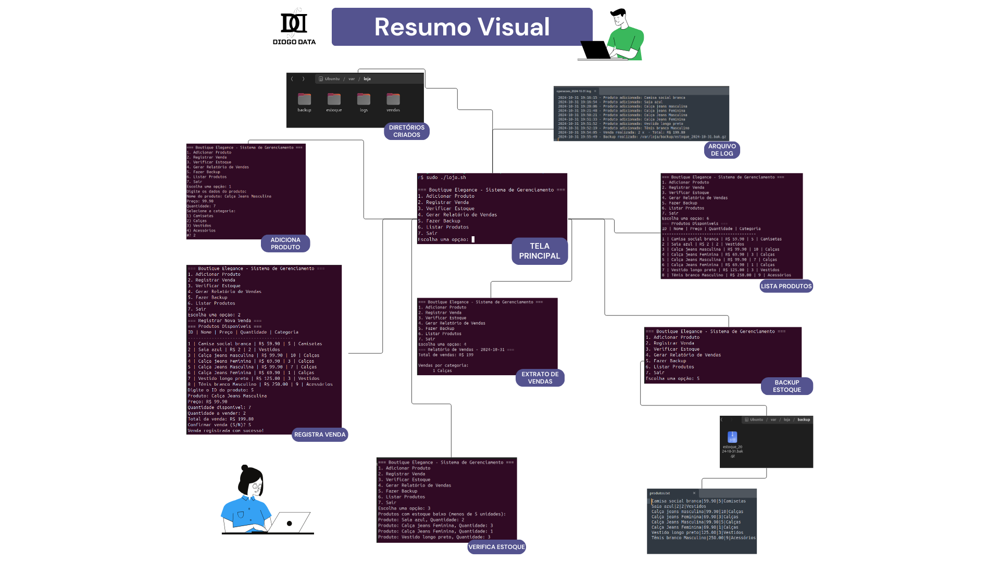

Shell scripts are powerful tools that allow you to automate various tasks on Unix and Linux systems. By encapsulating a series of commands in a single script, it is possible to streamline processes, reduce errors and increase operational efficiency. This versatile programming language makes it easy to manipulate files, automate administrative tasks and provide precise control over the system, making it ideal for a wide range of applications.

Using the knowledge acquired in the course [Hands-on Introduction to Linux Commands and Shell Scripting](https://www.coursera.org/account/accomplishments/verify/30JGE2RZY8T4 "Visit the course certificate"), I applied the project to a real-world scenario, Boutique Manager, which consists of a shell script management system for small clothing stores. 

The system provides an integrated set of essential functions for managing a clothing store, starting with product registration, which allows you to record detailed information by category and manage stock automatically. The sales module processes transactions in real time, updating stock levels and recording information such as date, time and value. In addition, a stock monitoring system proactively alerts you to low product levels, facilitating replenishment. Sales reports provide comprehensive analysis of business performance, including totals by category and period.

Data security and integrity is ensured by an automated backup system that protects critical information on a daily basis, and a robust logging system that records all operations for audit purposes. The system performs validations on critical operations, such as checking available stock before selling, and uses temporary files to maintain integrity during updates. All of this functionality is accessible through an intuitive menu that organises operations logically, allowing users with different levels of experience to operate the system efficiently, resulting in more effective and secure store management.

 

*Note: Open the image in a new browser tab to get the zoom you need.*

 

The shell script management project uses several essential techniques, including environment variables such as LOJA_DIR and DATA, defined with the export command, to facilitate environment configuration. Data manipulation is optimised through the use of pipes and filters such as awk, sort and uniq, allowing relevant statistics to be generated. Meta characters such as * for file patterns and $(...) for command substitution are also used to increase script flexibility. I/O redirection is used to record logs and create new files, ensuring efficient data management.

Modularising the code through functions improves readability and maintainability, while passing parameters allows greater reusability. Conditional structures such as if/then/else and case are used to manage the system menu, complemented by while loops that facilitate user interaction and iteration over arrays such as categories. Task scheduling is managed by cron, which ensures automatic backups and weekly inventory checks, contributing to the robustness and reliability of the system. Data security is provided by atomic operations using temporary files during updates, while a record of all operations is maintained through time-stamped logs using the date command.

The benefits of scripting automation are enormous. By automating repetitive tasks, you can save time, reduce the risk of human error and ensure process consistency. In addition, scripts can be used to monitor systems, generate reports and perform backups, providing greater security and reliability. In an increasingly digital world, scripting automation is becoming a competitive differentiator for organisations seeking to optimise processes and achieve operational excellence.

For more details, to implement this project, or to make suggestions and improvements, visit the repository link below.

#### Project repository

https://github.com/diogo-dantas/boutique-manager

<a href="http://www.freepik.com">Designed by gstudioimagen / Freepik</a>
